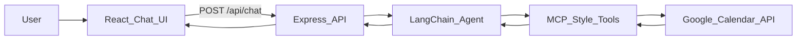

# AI Calendar Assistant

A full-stack TypeScript demo that lets users manage Google Calendar from a chat UI. The app uses a React frontend, an Express backend, a LangChain OpenAI agent, and a modular MCP-style tool layer for Google Calendar operations.

## Architecture



## Project Structure

```text
.
├── apps
│   ├── api
│   │   └── src
│   │       ├── agent
│   │       ├── google
│   │       └── mcp
│   └── web
│       └── src
├── packages
│   └── shared
└── README.md
```

## Features

- Chat-based calendar management.
- Natural language event creation, listing, updates, and deletion.
- LangChain OpenAI tool calling.
- MCP-style tools: `create_event`, `list_events`, `update_event`, and `delete_event`.
- Google Calendar OAuth for a single demo account.
- Google Calendar event links returned to the UI.

## Setup

1. Install dependencies:

   ```bash
   npm install
   ```

2. Create environment files:

   ```bash
   cp .env.example apps/api/.env
   cp .env.example apps/web/.env
   ```

3. Set at least these values in `apps/api/.env`:

   ```bash
   OPENAI_API_KEY=sk-your-openai-key
   GOOGLE_CLIENT_ID=your-client-id.apps.googleusercontent.com
   GOOGLE_CLIENT_SECRET=your-client-secret
   GOOGLE_REDIRECT_URI=http://localhost:4000/auth/google/callback
   GOOGLE_CALENDAR_ID=primary
   FRONTEND_URL=http://localhost:5173
   API_PORT=4000
   ```

4. Set this value in `apps/web/.env`:

   ```bash
   VITE_API_URL=http://localhost:4000
   ```

## Google Calendar OAuth

1. Create a Google Cloud project.
2. Enable the Google Calendar API.
3. Create an OAuth Client ID for a web application.
4. Add this authorized redirect URI:

   ```text
   http://localhost:4000/auth/google/callback
   ```

5. Start the API and visit:

   ```text
   http://localhost:4000/auth/google
   ```

6. Approve access, then copy the refresh token shown on the callback page into `GOOGLE_REFRESH_TOKEN` in `apps/api/.env`.
7. Restart the API server.

## Running Locally

Start both apps:

```bash
npm run dev
```

Or start them separately:

```bash
npm run dev:api
npm run dev:web
```

Open the web app at [http://localhost:5173](http://localhost:5173).

## Running With Docker

Docker lets you package the app with its runtime so it runs the same way on your laptop and on a hosting platform.

This project uses two containers:

- `api`: Node.js container running the Express/LangChain backend.
- `web`: Nginx container serving the built React app.

Build and start both containers:

```bash
docker compose up --build
```

Open the containerized web app at [http://localhost:8080](http://localhost:8080).

The API is available at [http://localhost:4000](http://localhost:4000).

For local Docker, keep these OAuth values:

```bash
FRONTEND_URL=http://localhost:8080
GOOGLE_REDIRECT_URI=http://localhost:4000/auth/google/callback
```

The Compose file reads secrets from `.env` and `apps/api/.env` at runtime. The Docker images do not copy `.env` files.

Stop the containers:

```bash
docker compose down
```

## Render Deployment Reference

Current deployed services:

- Web: [https://ai-calendar-web.onrender.com](https://ai-calendar-web.onrender.com)
- API: [https://ai-calender-assistant.onrender.com](https://ai-calender-assistant.onrender.com)
- API health check: [https://ai-calender-assistant.onrender.com/health](https://ai-calender-assistant.onrender.com/health)

Render environment variables:

```bash
# API service
FRONTEND_URL=https://ai-calendar-web.onrender.com
GOOGLE_REDIRECT_URI=https://ai-calender-assistant.onrender.com/auth/google/callback

# Web service
VITE_API_URL=https://ai-calender-assistant.onrender.com
```

Google OAuth authorized redirect URI:

```text
https://ai-calender-assistant.onrender.com/auth/google/callback
```

## Example Prompts

- "Schedule a meeting tomorrow at 6 PM for 1 hour"
- "What do I have this week?"
- "Move my 3 PM meeting to 5 PM"
- "Cancel my 6 PM event"

## Verification

```bash
npm run typecheck
npm run build
```

The Calendar tools require valid OpenAI and Google OAuth credentials for real calendar calls. Without credentials, the app still builds and the API returns setup guidance.
